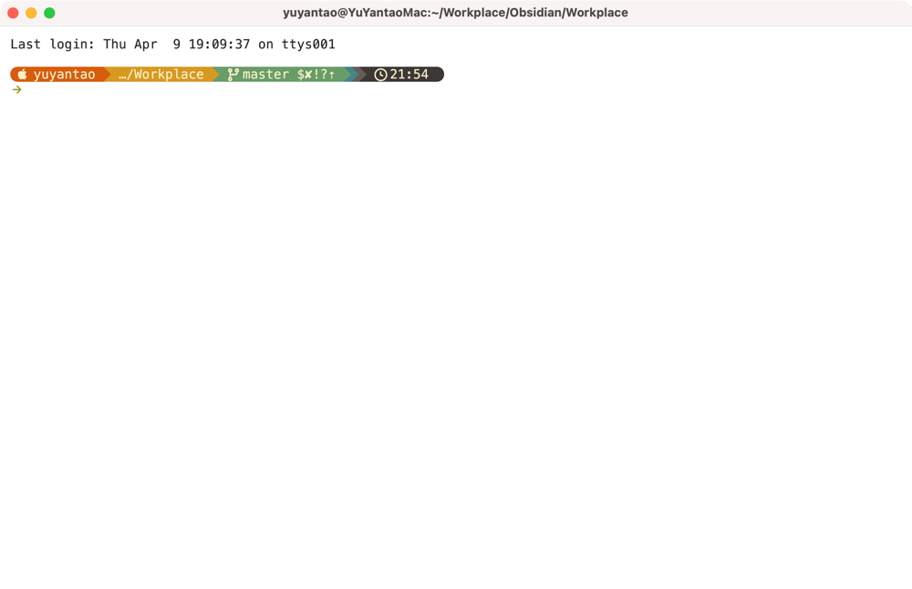

> 如果文章中有不准确的地方，欢迎留言指正。

## Kitty

### 安装

```bash
brew install --cask kitty
```

### 配置

配置文件路径：`~/.config/kitty/kitty.conf`

```conf
font_family      font-maple-mono-nl-nf-cn
font_size        14.0

background_opacity 1
dynamic_background_opacity yes
window_padding_width 10

remember_window_size  no
initial_window_width  1000
initial_window_height 618

confirm_os_window_close 0
scrollback_lines 10000
enable_audio_bell no

allow_remote_control yes
copy_on_select yes
strip_trailing_spaces smart

tab_bar_edge bottom
tab_bar_style powerline
tab_powerline_style slanted
tab_title_template "{index}: {title}"

enabled_layouts splits
map cmd+d launch --location=hsplit
map cmd+r launch --location=vsplit
map cmd+w close_window

map cmd+left  neighboring_window left
map cmd+right neighboring_window right
map cmd+up    neighboring_window up
map cmd+down  neighboring_window down

map cmd+shift+left  resize_window narrower
map cmd+shift+right resize_window wider
map cmd+shift+up    resize_window taller
map cmd+shift+down  resize_window shorter

map cmd+t new_tab
map cmd+shift+[ previous_tab
map cmd+shift+] next_tab

map cmd+, edit_config_file
map cmd+ctrl+, load_config_file

include current-theme.conf
```

设置主题

```shell
kitty +kitten themes
```

## Oh My Zsh

### 安装

先安装 Oh My Zsh：

```bash
sh -c "$(curl -fsSL https://raw.githubusercontent.com/ohmyzsh/ohmyzsh/master/tools/install.sh)"
```

安装第三方插件：

```bash
git clone https://github.com/zsh-users/zsh-autosuggestions ${ZSH_CUSTOM:-~/.oh-my-zsh/custom}/plugins/zsh-autosuggestions
git clone https://github.com/zsh-users/zsh-syntax-highlighting.git ${ZSH_CUSTOM:-~/.oh-my-zsh/custom}/plugins/zsh-syntax-highlighting
```

### 配置

```shell
setopt no_nomatch

export ZSH="$HOME/.oh-my-zsh"
ZSH_THEME=""
plugins=(git last-working-dir extract brew zsh-autosuggestions zsh-syntax-highlighting)
source $ZSH/oh-my-zsh.sh

eval "$(starship init zsh)"
```

- `git`：提供大量 Git alias 和函数，减少重复输入。
- `last-working-dir`：记住上一次目录，新开终端自动回到最近工作目录。
- `extract`：统一用 `extract <文件>` 解压常见压缩格式。
- `brew`：提供 Homebrew 常用 alias，并自动处理 shellenv。
- `zsh-autosuggestions`：基于历史命令给出灰色自动补全建议。
- `zsh-syntax-highlighting`：命令输入时语法高亮，提前发现拼写/语法问题。

加载配置

```bash
source ~/.zshrc
```

## Starship

### 安装

```bash
brew install starship
```

### 配置

使用预置主题

```shell
starship preset pastel-powerline -o ~/.config/starship.toml
```


配置文件路径：`~/.config/starship.toml`