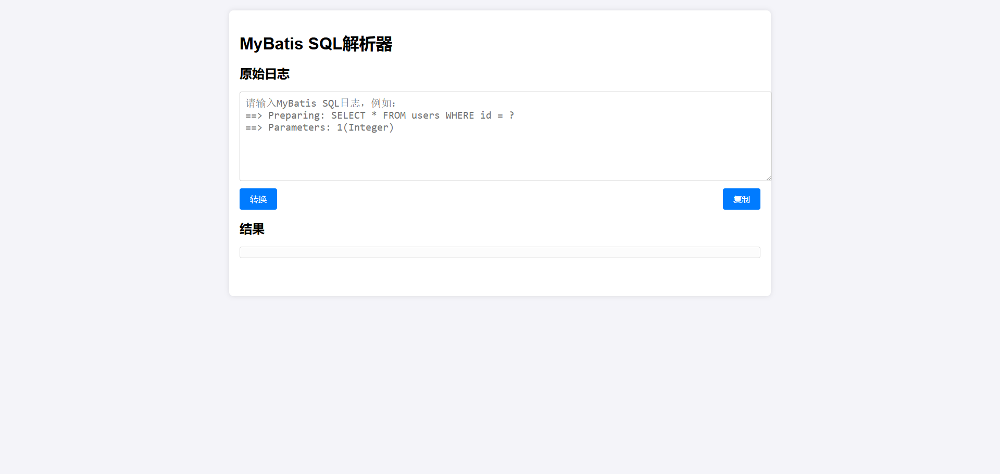

> 如果文章中有不准确的地方，欢迎留言指正。

## 1.简介

MyBatisSQL日志解析工具，将日志转换为可执行SQL。

找了几个插件，但是没有找到适合的，不符合我的使用习惯，所以自己写了一个，HTML+CSS+JS三件套，方便随时修改。

## 2.预览



## 3.源码

```html
<!DOCTYPE html>
<html lang="zh-CN">
<head>
    <meta charset="UTF-8">
    <title>MyBatis SQL解析器</title>
    <style>
        body {
            font-family: Arial, sans-serif;
            margin: 20px;
            padding: 0;
            background-color: #f4f4f9;
        }

        .container {
            max-width: 1000px; /* 增加最大宽度 */
            margin: auto;
            background: white;
            padding: 20px;
            border-radius: 8px;
            box-shadow: 0 0 10px rgba(0, 0, 0, 0.1);
        }

        textarea {
            width: 100%;
            height: 150px;
            margin-bottom: 10px;
            padding: 10px;
            border: 1px solid #ccc;
            border-radius: 4px;
            resize: vertical;
            font-family: 'Consolas', 'Menlo', monospace; /* 使用等宽字体 */
            font-size: 20px;
        }

        .button-container {
            display: flex;
            justify-content: space-between;
            margin-bottom: 20px;
        }

        button {
            padding: 10px 20px;
            background-color: #007bff;
            color: white;
            border: none;
            border-radius: 4px;
            cursor: pointer;
            font-size: 16px;
        }

        button:hover {
            background-color: #0056b3;
        }

        .result {
            margin-top: 20px;
            padding: 10px;
            border: 1px solid #ddd;
            border-radius: 4px;
            background-color: #fcfcfc;
            white-space: pre-wrap;
            font-family: 'Consolas', 'Menlo', monospace;
            font-size: 20px;
        }

        .copy-message {
            margin-top: 10px;
            padding: 10px;
            background-color: #d4edda;
            color: #155724;
            border: 1px solid #c3e6cb;
            border-radius: 4px;
            opacity: 0;
            transition: opacity 0.5s ease-in-out;
        }

        .copy-message.show {
            opacity: 1;
        }
    </style>

</head>
<body>
<div class="container">
    <h1>MyBatis SQL解析器</h1>

    <!-- 原始日志 -->
    <h2>原始日志</h2>
    <label for="sql"></label>
    <textarea id="sql" placeholder="请输入MyBatis SQL日志，例如：
==> Preparing: SELECT * FROM users WHERE id = ?
==> Parameters: 1(Integer)"></textarea>

    <div class="button-container">
        <button onclick="generateSql()">转换</button>
        <button onclick="copyToClipboard()">复制</button>
    </div>

    <!-- 结果 -->
    <h2>结果</h2>
    <div class="result" id="result"></div>
    <div class="copy-message" id="copyMessage">已复制到剪贴板</div>
</div>

<script>
    /**
     * 生成SQL
     */
    function generateSql() {
        let sqlInput = document.getElementById('sql').value;
        // 这里可以添加生成完整SQL的逻辑
        const resultDiv = document.getElementById('result');
        resultDiv.textContent = replaceParametersInSql(sqlInput)
        // 自动复制到剪贴板
        copyToClipboard();
    }

    /**
     * 复制到剪切板
     */
    function copyToClipboard() {
        const resultText = document.getElementById('result').textContent;
        if (resultText) {
            navigator.clipboard.writeText(resultText)
                    .then(() => showCopyMessage())
                    .catch(err => console.error("无法复制文本: ", err));
        }
    }

    /**
     * 显示复制信息
     */
    function showCopyMessage() {
        const messageDiv = document.getElementById('copyMessage');
        messageDiv.classList.add('show');
        setTimeout(() => {
            messageDiv.classList.remove('show');
        }, 2000);
    }

    /**
     *
     * 解析MyBatis日志
     * 日志格式
     * ==>  Preparing: SELECT * FROM users WHERE id = ? （末尾有个"\n"）
     * ==> Parameters: 1(Integer)
     * @param log
     * @returns {string|null}
     */
    function replaceParametersInSql(log) {
        // 使用正则表达式提取Preparing部分的SQL语句
        const preparingMatch = log.match(/Preparing: (.*)/);
        if (!preparingMatch) {
            return null;
        }

        let sql = preparingMatch[1].trim();

        // 使用正则表达式提取Parameters部分的参数
        const parametersMatch = log.match(/Parameters: (.*)/);
        if (!parametersMatch) return "No parameters found";

        const parametersString = parametersMatch[1];
        // 使用正则表达式匹配参数值和类型
        const parameterPattern = /(\S+)\(([^)]+)\)/g;
        let match;
        const parameterPairs = [];

        while ((match = parameterPattern.exec(parametersString)) !== null) {
            const value = match[1];
            const type = match[2];
            parameterPairs.push([value, type]);
        }

        // 替换SQL语句中的占位符
        for (let i = 0; i < parameterPairs.length; i++) {
            const [value, type] = parameterPairs[i];
            // 字符串，时间戳，日期加上单引号
            console.log(type)
            if (type === "String" || type === "Timestamp" || type === "Date") {
                sql = sql.replace("?", "'" + value.trim() + "'");
            } else {
                // 其他类型
                sql = sql.replace("?", value.trim());
            }
        }
        return sql;
    }
</script>
</body>
</html>

```