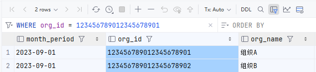
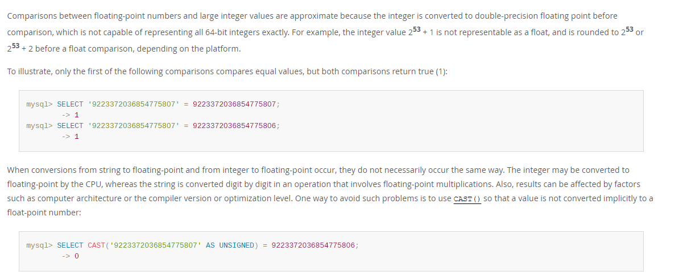

> 如果文章中有不准确的地方，欢迎留言指正。

## 1.问题描述

最近发现个有意思的问题，有一张表，有个字段`org_id`是`varchar(32)`，我在用DataGrip查询数据时，在查询栏中输入了
`org_id = 123456789012345678901`（因为int和varchar类型之间有隐式转换，所以我一般在用工具过滤数据时，习惯都用数字），然后就出现了诡异的现象，如图：

出现了`org_id = 123456789012345678902`的数据。

## 2.原因分析

经过我几轮的测试，发现了如下规律：

1. 当数字较小时，不会发生这个问题
2. 在一定的范围内，这些数字都是相等的，例如从123456789012345678000到123456789012345678999
3. 数字较大时，当数字位数不相等时，两个数字不相等

就当我以为要为MySQL添砖加瓦时，上网搜了一下，结果发现不止我一个人发现了这个问题。

然后去[MySQL官网](https://dev.mysql.com/doc/refman/8.0/en/type-conversion.html)查了一下，找到了如下内容:

大致翻译了一下，意思是大整数比较时，会被转换成双精度浮点数，但是双精度浮点数精度有限，所以大整数比较时，会丢失精度，导致比较结果不正确。
官方给的例子中，解决方法是使用`CAST`函数。

在写SQL还是要养成良好的习惯，避免使用隐式转换。

## #.参考

- [MySQL隐式转化整理](https://www.cnblogs.com/rollenholt/p/5442825.html)，详细介绍了隐式转换规则。
- [MySQL官网](https://dev.mysql.com/doc/refman/8.0/en/type-conversion.html)，MySQL8.0官方文档
