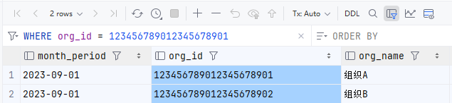
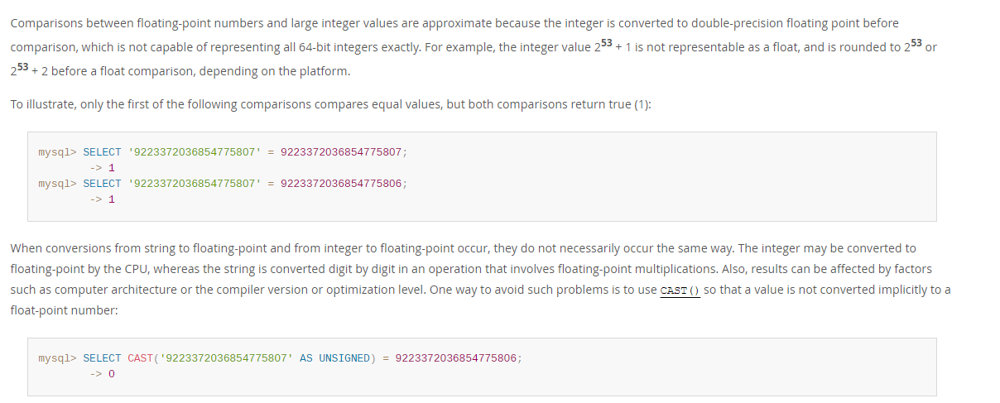

> 如果文章中有不准确的地方，欢迎留言指正。

在排查数据时，我遇到过一个一眼看上去像“数据库出 bug 了”的现象：查询条件写的是一个值，结果却命中了另一个值。后来回头看，这其实不是 MySQL 出错，而是我自己在比较 `varchar` 字段时偷懒，把字符串条件写成了数字。

## 问题现象

有一张表，其中 `org_id` 字段定义为 `varchar(32)`。我在 DataGrip 中直接输入了下面这个过滤条件：

`org_id = 123456789012345678901`

因为平时在工具里做临时过滤时，我经常直接写数字，默认数据库会帮我处理类型转换。结果这次出现了很离谱的现象，如图：



结果里居然出现了 `org_id = 123456789012345678902` 的数据。

## 原因分析

我做了几轮测试，发现大致有这样几个规律：

1. 当数字较小时，不会发生这个问题
2. 在一定范围内，这些数字会被当成相等值，例如从 `123456789012345678000` 到 `123456789012345678999`
3. 数字位数不同时，不一定会被判定为相等

后来查了 MySQL 官方文档，才发现这并不是个冷门问题。

文档里提到，当字符串和数字参与比较时，MySQL 会进行隐式类型转换。对于特别大的整数，这个转换过程可能会把值转成双精度浮点数，而双精度浮点数的精度是有限的，所以会出现比较结果失真的情况。

我在官方文档中找到的说明如下：



官方给出的处理思路也很明确：需要跨类型比较时，显式使用 `CAST`，不要把正确性寄托在隐式转换上。

## 应该怎么避免

以后再遇到类似场景，我会优先遵守这几个原则：

1. **字段是字符串，条件值就按字符串写**

   ```sql
   where org_id = '123456789012345678901'
   ```

2. **确实需要跨类型比较时，显式转换**

   不要让数据库替你猜类型，尤其是主键、业务编号、组织 id 这类可能很长的值。

3. **工具里的临时过滤也别偷懒**

   很多问题不是出在正式 SQL，而是出在平时图方便的临时查询里。

## 总结

这次问题看起来像是“查错数据了”，本质上其实是**字符串字段和数字字面量比较时发生了隐式类型转换**。  
只要字段语义上是字符串，就应该坚持按字符串处理；一旦依赖隐式转换，结果就可能在边界值上变得不可预测。

## 参考资料

- [MySQL隐式转化整理](https://www.cnblogs.com/rollenholt/p/5442825.html)，详细介绍了隐式转换规则。
- [MySQL官网](https://dev.mysql.com/doc/refman/8.0/en/type-conversion.html)，MySQL8.0官方文档
