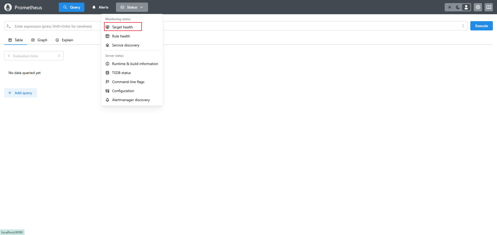
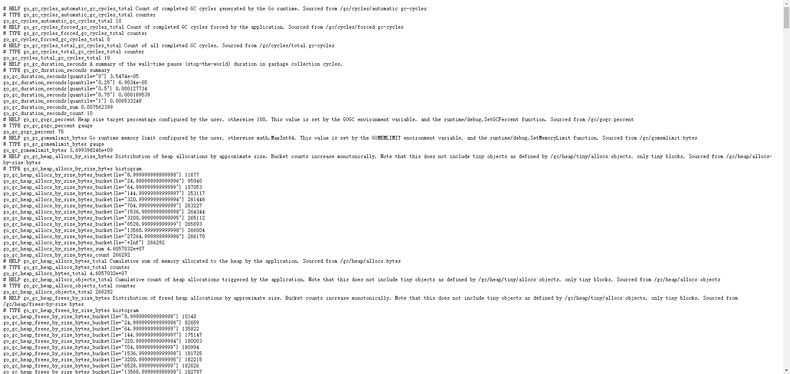
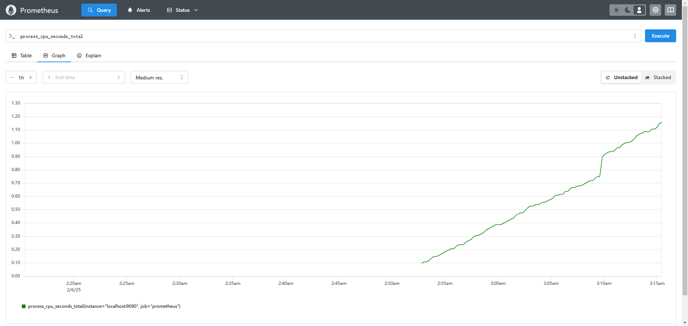
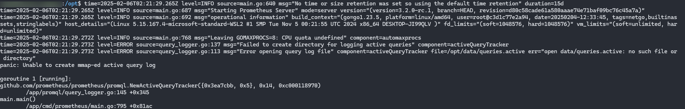
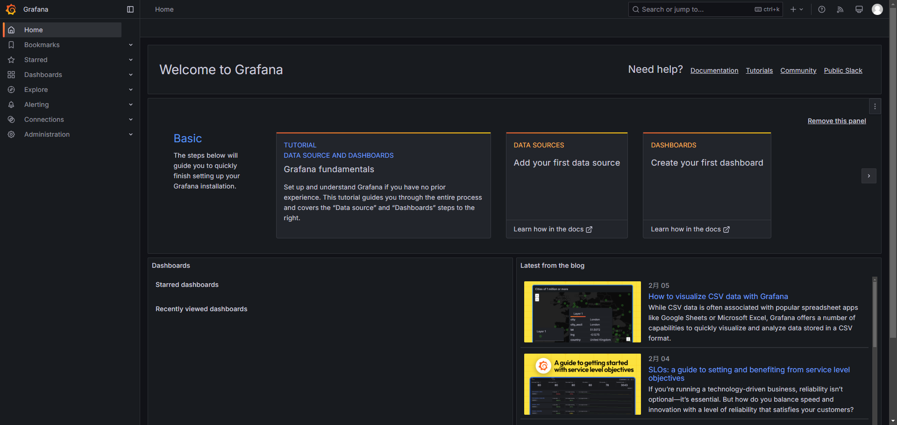

> 如果文章中有不准确的地方，欢迎留言指正。

## 1.介绍

* Prometheus 是一个开源的系统监控和警报工具，可以从目标系统中抓取指标数据，帮助开发者监控系统。
* Grafana 是一个开源的数据可视化工具，可以展示Prometheus抓取到的指标数据，Prometheus 也支持数据可视化，但Grafana可以更好的展示数据。

## 2.安装 Prometheus

### 2.1 安装 Prometheus

* 官网下载二进制包，[https://prometheus.io/download/](https://prometheus.io/download/)
* Docker 安装：[官网Docker安装教程](https://prometheus.io/docs/prometheus/latest/installation/#using-docker)

以上两种安装方式，选择合适的即可，我这里选择的是Docker安装。

1. 拉取镜像

```shell
docker pull prom/prometheus
```

2. 配置文件

```shell

# 创建目录
mkdir -p /etc/prometheus/config

# 创建配置文件
vim /etc/prometheus/config/prometheus.yml

global:
  # 设置全局抓取间隔为 15 秒
  scrape_interval: 15s

scrape_configs:
  - job_name: 'prometheus'
    static_configs:
      # 配置 Prometheus 抓取自己的指标数据
      - targets: [ 'localhost:9090' ]
```

3. 启动容器

```shell
docker run -d \
    -p 9090:9090 \
    -v /etc/prometheus/config:/etc/prometheus \
	--name prometheus \
    prom/prometheus
```

4. 访问[http://localhost:9090](http://localhost:9090)
   

5. 查看本机数据，点击上图中的Target health
   

6. 查看指标
   

### 2.2 安装 MySQL-Exporter

Prometheus提供了多个Exporter，用于收集不同的指标数据，MySQL-Exporter是用于收集MySQL指标数据。

官网下载二进制包，[https://github.com/prometheus/mysqld_exporter/releases](https://github.com/prometheus/mysqld_exporter/releases)

### 2.3 可能遇到的问题

1. 二进制安装时，启动报错，
   提示创建文件失败，原因是没有权限，解决方法：加上**sudo**

## 3.安装 Grafana

### 3.1 安装

* 官网下载二进制包，[https://grafana.com/grafana/download](https://grafana.com/grafana/download)
* Docker 安装：[官网Docker安装教程](https://grafana.com/grafana/download?platform=docker)

以上两种安装方式，选择合适的即可，我这里选择的是Docker安装。

1. 拉取镜像并启动容器

```shell
docker run -d -p 3000:3000 --name grafana -v /var/lib/grafana:/var/lib/grafana grafana/grafana
```

2. 访问[http://localhost:3000](http://localhost:3000)，使用默认用户名 admin，密码 admin，第一次登录时会提示修改密码，修改后登录即可。
   