> 如果文章中有不准确的地方，欢迎留言指正。

## 1.介绍

- Prometheus 是一个开源的系统监控和警报工具，可以从目标系统中抓取指标数据，帮助开发者监控系统。
- Grafana 是一个开源的数据可视化工具，可以展示 Prometheus 抓取到的指标数据，Prometheus 也支持数据可视化，但 Grafana
  可以更好的展示数据。

> 注意：本文是本地学习使用，所以 Prometheus，Grafana，MySQL，MySQL-Exporter，都安装在本地的 Docker 中，要将它们加入到同一个网络中，并且使用容器id作为
> host，不能使用 localhost，否则无法访问。如果需要使用远程服务器，则需要修改配置文件，将host替换为远程服务器的ip地址。

## 2.安装 Prometheus

### 2.1 安装 Prometheus

- 官网下载二进制包，[https://prometheus.io/download/](https://prometheus.io/download/)
- Docker 安装：[官网 Docker 安装教程](https://prometheus.io/docs/prometheus/latest/installation/#using-docker)

以上两种安装方式，选择合适的即可，我这里选择的是 Docker 安装。

1. 创建网络
   ```shell
   docker network create my-network
   ```
2. 配置文件
   ```shell

   # 创建目录
   mkdir -p /opt/local/Docker/prometheus/config

   # 创建配置文件
   vim /opt/local/Docker/prometheus/config/prometheus.yml
   global:
   scrape_interval: 15s # 设置全局抓取间隔为 15 秒

   scrape_configs:
   - job_name: 'prometheus' # 监控主机
      static_configs:
         - targets: [ 'localhost:9090' ]
   ```
3. 启动容器
   ```shell
   docker run -d \
       -p 9090:9090 \
       -v /opt/local/Docker/prometheus/config:/etc/prometheus \
       --name prometheus \
       --network my-network \
       prom/prometheus
   ```
4. 访问[http://localhost:9090](http://localhost:9090)
   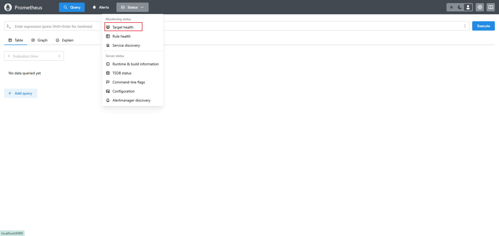
5. 查看本机数据，点击上图中的 Target health
   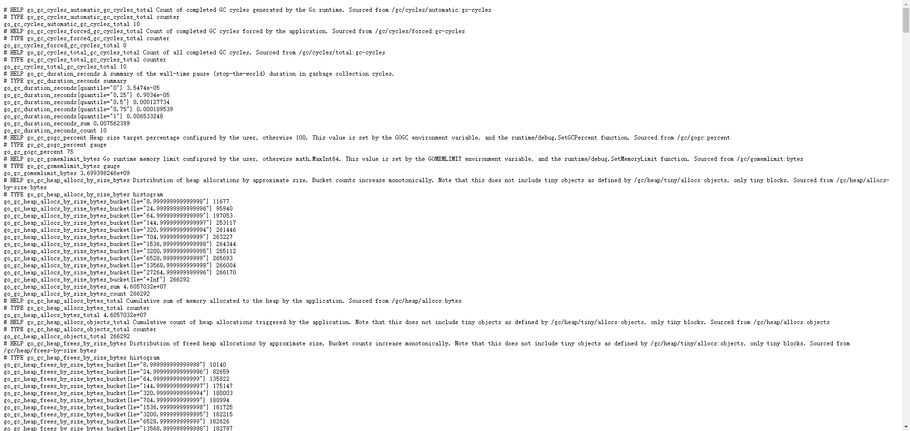
6. 查看指标
   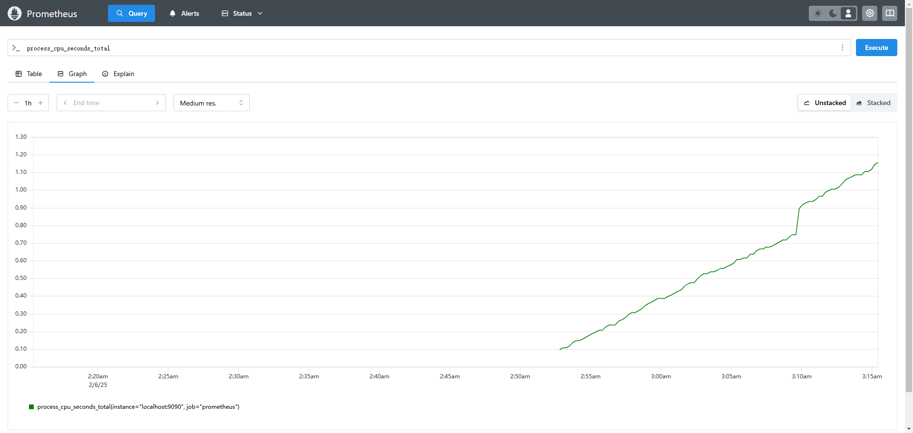

### 2.2 安装 MySQL-Exporter

Prometheus 提供了多个 Exporter，用于收集不同的指标数据，MySQL-Exporter 是用于收集 MySQL 指标数据。

- 官网下载二进制包，[https://github.com/prometheus](https://github.com/prometheus/mysqld_exporter/releases)

- Docker 安装，[官网 Docker 安装教程](https://github.com/prometheus/mysqld_exporter)

我这里选择的是Docker安装。

1. 配置文件
   ```shell
   # 创建目录
   mkdir -p /opt/local/Docker/mysql-exporter
   
   # 创建配置文件
   vim /opt/local/Docker/mysql-exporter/my.cnf
   
   # 配件文件
   [client]
   # 如果MySQL在 docker 中，容器id是 mysql，此处为 host = mysql
   host = your_mysql_host
   user = your_mysql_user
   password = your_mysql_password

   ```
2. 启动容器
   ```shell
   docker run -d \
   -p 9104:9104 \
   -v /opt/local/Docker/mysql-exporter/my.cnf:/.my.cnf \
   --network my-network \
   --name mysql-exporter \
   prom/mysqld-exporter
   ```

3. 修改 Prometheus 配置文件，添加如下内容：
   ```shell
   vim /opt/local/Docker/prometheus/config/prometheus.yml
   # 配置文件

   global:
   scrape_interval: 15s # 设置全局抓取间隔为 15 秒

   scrape_configs:
   - job_name: 'prometheus' # 监控主机
      static_configs:
         - targets: [ 'localhost:9090' ]

   - job_name: 'mysqld-exporter'
      static_configs:
         # 注意此处
         - targets: ['mysql-exporter:9104']
   ```
4. 查看 MySQL 信息

   [http://localhost:9104/metrics](http://localhost:9104/metrics)

   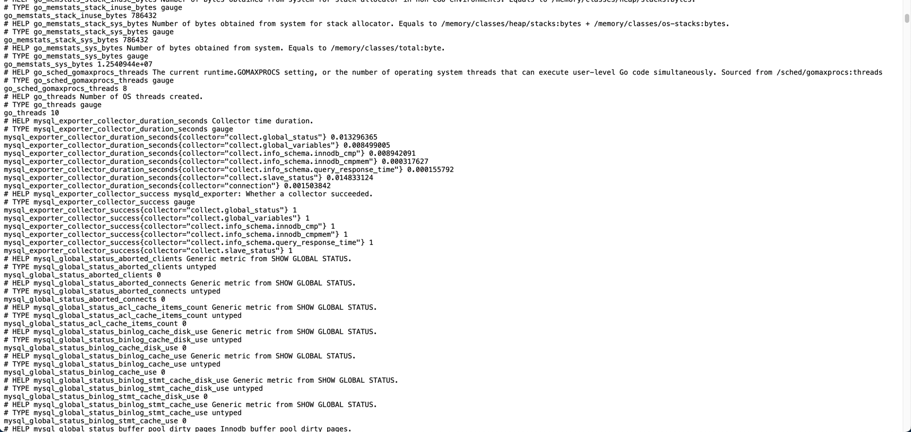
   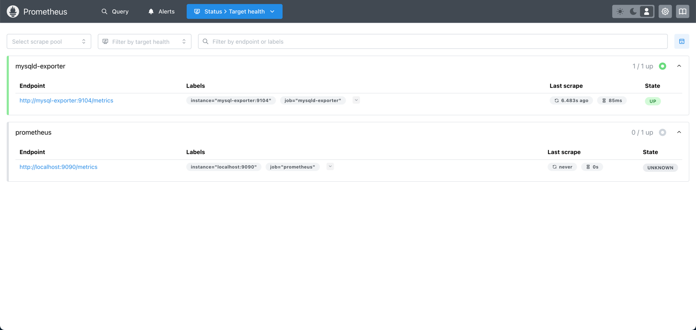

### 2.3 可能遇到的问题

> Docker 查看容器日志，docker logs xxx

1. WSL中使用二进制文件安装时，启动报错，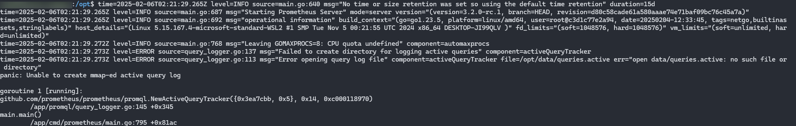
   提示创建文件失败，原因是没有权限，解决方法：加上**sudo**，在WSL中如果日志中提升创建xxx失败，大多数是因为权限不足。

## 3.安装 Grafana

### 3.1 安装

- 官网下载二进制包，[https://grafana.com/grafana/download](https://grafana.com/grafana/download)
- Docker 安装：[官网 Docker 安装教程](https://grafana.com/grafana/download?platform=docker)

以上两种安装方式，选择合适的即可，我这里选择的是 Docker 安装。

1. 拉取镜像并启动容器
   ```shell
   docker run -d -p 3000:3000 --name grafana --network my-network -v /opt/local/Docker/grafana:/var/lib/grafana grafana/grafana
   ```
2. 访问[http://localhost:3000](http://localhost:3000)，使用默认用户名 admin，密码 admin，第一次登录时会提示修改密码，修改后登录即可。
   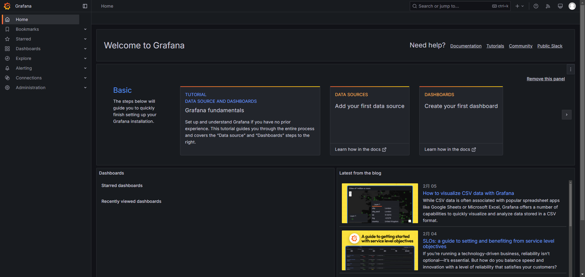
3. 添加数据源，不通版本页面添加数据源的方式不同，如果找不到可以在上方搜索Data sources
   3.1 选择添加数据源，选择 Prometheus
   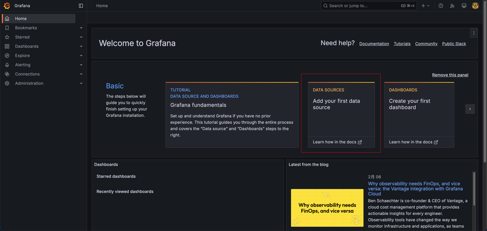
   3.2 填入配置信息

   如果是本地学习，只需要配置 url 即可，不过需要注意的是，如果是docker中安装的，url中的 localhost ，要写Prometheus的容器id
   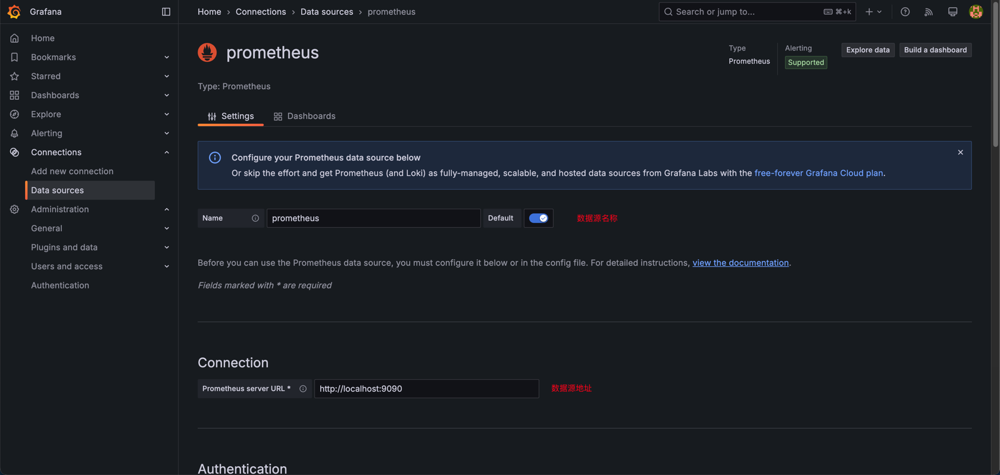
   3.测试连接
   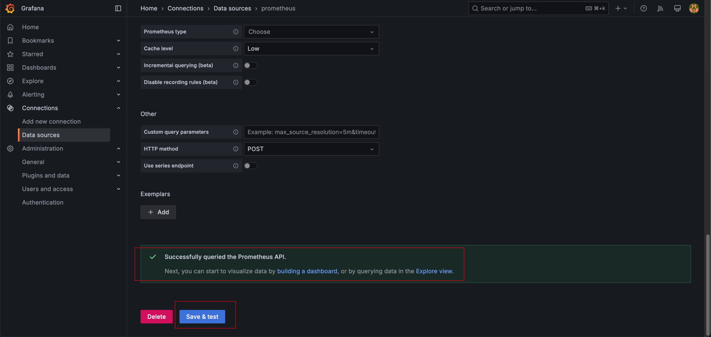

### 3.2 添加 MySQL 监控面板

> 面板模板下载地址：[https://grafana.com/grafana/dashboards/](https://grafana.com/grafana/dashboards/)

Grafana 官方提供了监控 MySQL 指标的面板模板，直接导入即可。

1. 导入模板
   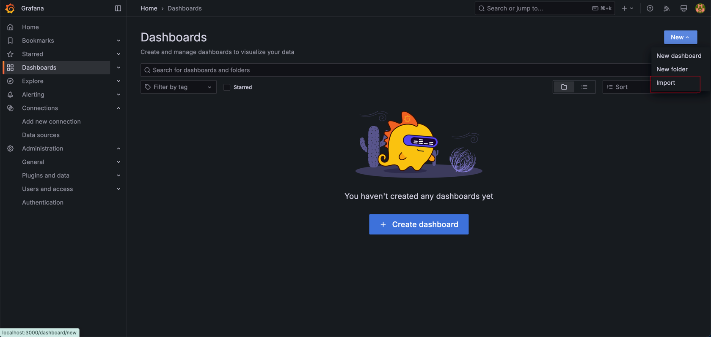
2. 填入模板 id，7362
   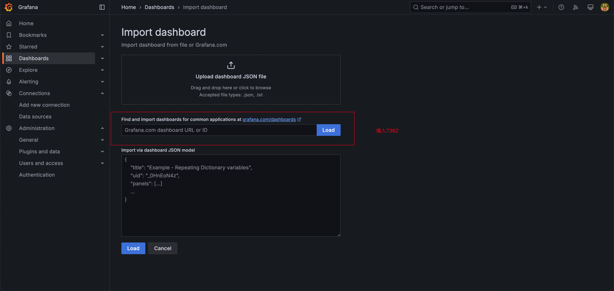
3. 选择数据源
   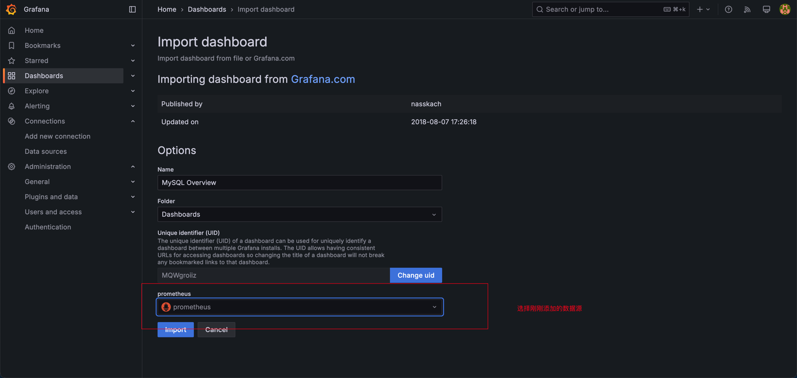
4. 查看结果
   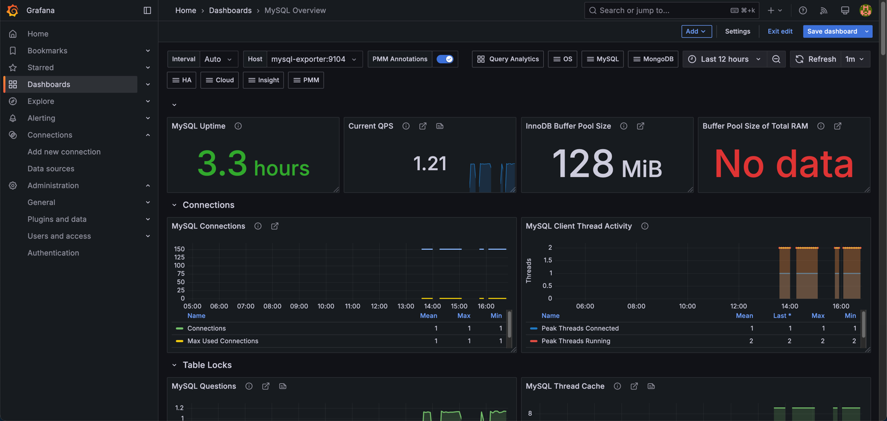

### 3.3 可能遇到的问题

1. 面板显示 No data

> No data，有两个原因，1. Prometheus 没有抓取到数据（例如Query cache，在 MySQL 新版本中已经移除了），2. 由于版本差异，指标名不同，模板中的指标与
> Prometheus 抓取到的指标不同，所以无法显示，解决方法是，修改模板中的指标名即可，在图表右上方，点击 edit，会有公式编辑框，复制该变量名，到
> Prometheus 中搜索，找到名称类似的，即是正确的指标名。如果不确定，可以在官网搜索该指标。

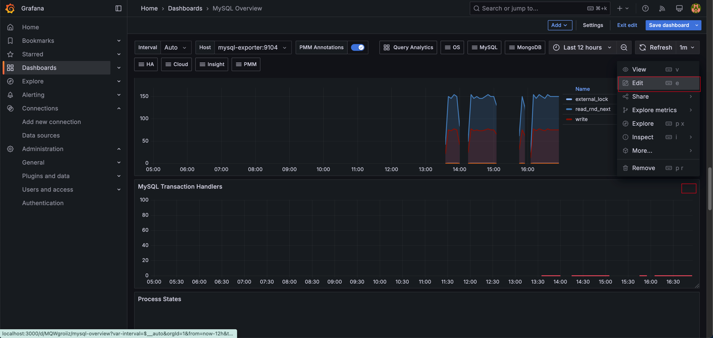
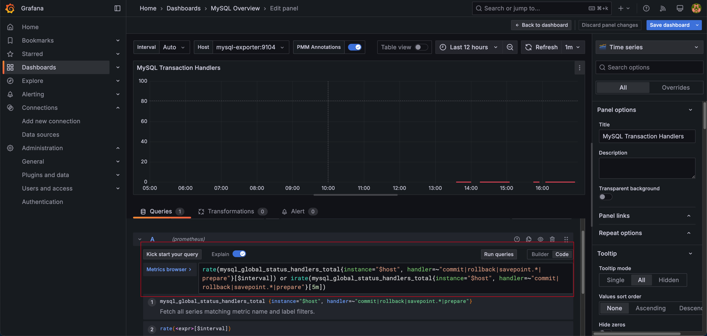